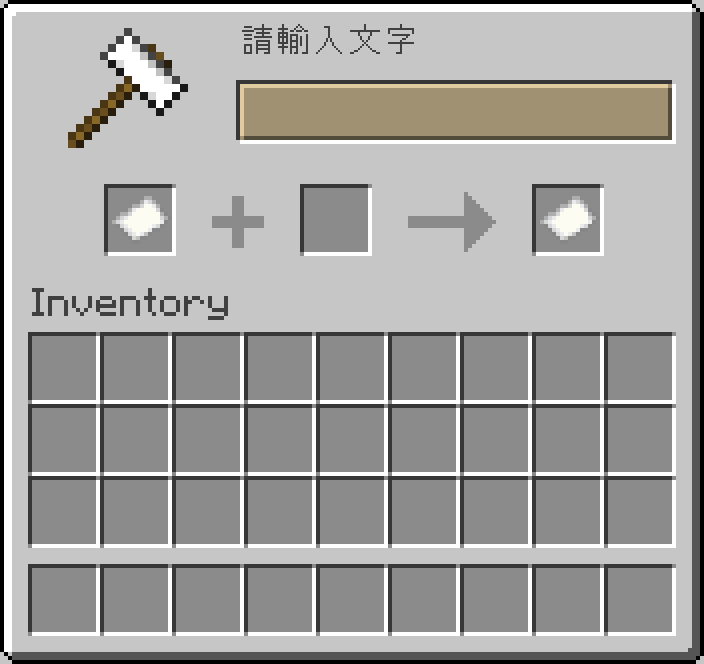

# Anvil Input API

**English** | [繁體中文](README.zh-TW.md)

A reusable text-input library for Skript: open an anvil window, let the player type, and receive the text in any script through a custom `on anvil input` event. Pure Skript + skript-reflect, no extra plugin needed.

> This repository has two editions of the same script: **繁體中文 (zh-TW)** is the original used on the author's Traditional Chinese server, and **English** is a full translation (commands, messages and variable names) with the same features.

<!-- BEGIN LIVE SCREENSHOTS -->

## Screenshots



*`/anvilinput` opening the demo prompt. The window type, title and both paper slots are exactly what the server sent in `open_window` / `window_items`.*

> These are live-server captures, not native client screenshots. A headless client logged into a real Paper 26.2 server, triggered the script, and the block / UI data the server sent back was re-rendered using the official Minecraft 26.2 client assets. Mojang/Microsoft image assets are not covered by this repository's code licence.

<!-- END LIVE SCREENSHOTS -->

## Features

- `openAnvilInput(player, id, default, title)` opens the input box from any script
- Custom event `on anvil input` plus the getters `anvilId(player)` / `anvilText(player)`
- Custom window title (`&` color codes supported) and optional default text
- Gives +1 XP level while the box is open so the rename cost is always affordable, and takes it back if the player cancels
- The paper used for typing never stays in the player's inventory
- `setAnvilTitle(player, title)` changes the title while the box is open
- Built-in demo command `/anvilinput`

## Requirements

- [Paper](https://papermc.io/) server (developed on Paper 26.2 / Minecraft 26.2) - Paper-only APIs are used (`openAnvil`, `titleOverride`, Adventure)
- [Skript](https://github.com/SkriptLang/Skript) (developed on 2.16.2)
- [skript-reflect](https://github.com/SkriptLang/skript-reflect) (developed on 2.6.3)

## Installation

1. Install the plugins listed under [Requirements](#requirements).
2. Download **one** edition:

   | Edition | File(s) |
   |---|---|
   | English | [`en/anvil_input_api.sk`](en/anvil_input_api.sk) |
   | 繁體中文 (original) | [`zh-TW/anvil_input_api.sk`](zh-TW/anvil_input_api.sk) |

3. Copy the `.sk` file(s) into `plugins/Skript/scripts/` on your server.
4. Run `/sk reload anvil_input_api` (use the file name you copied) or restart the server.

> [!IMPORTANT]
> Install **only one** edition. Both editions are the same script in different languages - loading both makes them clash or run twice.

## Usage from other scripts

```
# Open the input box (from any script)
openAnvilInput(player, "nickname", "", "&9Enter a nickname")

# Receive the result (in any script)
on anvil input:
    if anvilId(player) is "nickname":
        set {_text} to anvilText(player)
        send "You typed: %{_text}%" to player
```

## Commands

| Command (English edition) | zh-TW edition | Description | Permission |
|---|---|---|---|
| `/anvilinput` | `/anvilinput` | Opens a demo input box and echoes what you typed | everyone |

## Configuration

- The example listener (`demo`) and the `/anvilinput` test command at the bottom of the file can be deleted.

## Notes

- Keep the file name `anvil_input_api.sk` (or any name that sorts before the scripts using it) so the custom event is defined before other scripts load.
- Both editions use the same function names and event, so other scripts work with either edition.

## Related projects

- [skript-player-menu-gui](https://github.com/Im-Tim-mI/skript-player-menu-gui) - Player Menu GUI

## License

**MIT + Commons Clause** - see [LICENSE](LICENSE) for the full text.

- ✅ You may use, copy, modify and share this script.
- ✅ You **may** install and run it - including modified versions - on Minecraft servers that charge money or are run for profit.
- ❌ You may **not** sell the script itself or modified versions of it, directly or indirectly, or require payment to obtain its files or source code.

Copyright (c) 2026 廷廷小教室、廷廷的家（Tim945）
